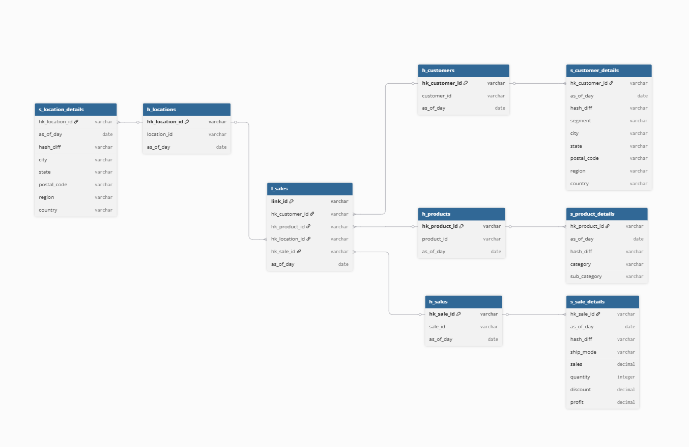

# Data_storage_systems_final_module5
## Этапы проекта:
1. **Исходные данные берутся из файла:**

- `SampleSuperstore.csv`

2. **Создание бизнес-ключей и разделение исходных данных на 9 составляющих после преобразований описано в:** 

- `Transform_data.ipynb`

3. **Загрузка в схему student9 осуществляется с помощью:**

- `Load_data.ipynb`

4. **Диаграмма связей** 
5. **Применяемые sql-скрипты:**
```
-------------
### ХАБЫ ###
-------------
create table student9.h_customers (
    hk_customer_id varchar(100),
    customer_id varchar(300),
    as_of_day date,
    constraint pk_hub_customers primary key (hk_customer_id)
) distributed by (hk_customer_id);

create table student9.h_products (
    hk_product_id varchar(100),
    product_id varchar(300),
    as_of_day date,
    constraint pk_hub_products primary key (hk_product_id)
) distributed by (hk_product_id);

create table student9.h_locations (
    hk_location_id varchar(100),
    location_id varchar(300),
    as_of_day date,
    constraint pk_hub_locations primary key (hk_location_id)
) distributed by (hk_location_id);

create table student9.h_sales (
    hk_sale_id varchar(100),
    sale_id varchar(300),
    as_of_day date,
    constraint pk_hub_sales primary key (hk_sale_id)
) distributed by (hk_sale_id);

-------------
### Линки ###
-------------
create table student9.l_sales (
    link_id varchar(100),
    hk_customer_id varchar(100),
    hk_product_id varchar(100),
    hk_location_id varchar(100),
    hk_sale_id varchar(100),
    as_of_day date,
    constraint pk_link_sales primary key (link_id)
) distributed by (link_id);

-----------------
### Саттелиты ###
-----------------
create table student9.s_customer_details (
    hk_customer_id varchar(100),
    as_of_day date,
    hash_diff varchar(100),
    segment varchar(150),
    city varchar(200),
    state varchar(150),
    postal_code varchar(100),
    region varchar(150),
    country varchar(150)
) distributed by (hk_customer_id);

create table student9.s_product_details (
    hk_product_id varchar(100),
    as_of_day date,
    hash_diff varchar(100),
    category varchar(150),
    sub_category varchar(150)
) distributed by (hk_product_id);


create table student9.s_location_details (
    hk_location_id varchar(100),
    as_of_day date,
    hash_diff varchar(100),
    city varchar(200),
    state varchar(150),
    postal_code varchar(100),
    region varchar(150),
    country varchar(150)
) distributed by (hk_location_id);

create table student9.s_sale_details (
    hk_sale_id varchar(100),
    as_of_day date,
    hash_diff varchar(100),
    ship_mode varchar(150),
    sales decimal(20,6),
    quantity integer,
    discount decimal(10,6),
    profit decimal(20,6)
) distributed by (hk_sale_id);
```
